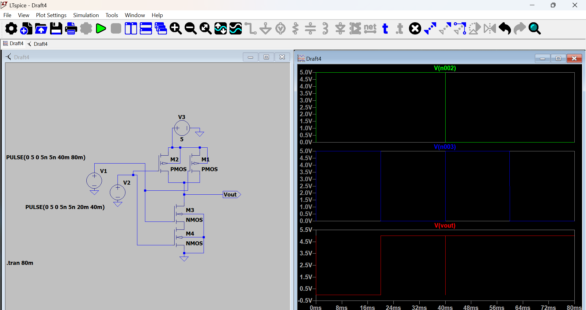

# CMOS NAND Gate

## Overview
This project simulates a 2-input CMOS NAND gate. It demonstrates the fundamental logic gate structure used in digital electronics, utilizing a combination of PMOS (pull-up) and NMOS (pull-down) transistors.

## Circuit Configuration
- **Technology:** CMOS (Complementary Metal-Oxide-Semiconductor)
- **Pull-Up Network:** Two PMOS transistors in parallel.
- **Pull-Down Network:** Two NMOS transistors in series.
- **Inputs:** Driven by `PULSE` voltage sources to verify the truth table.

## Truth Table
| Input A | Input B | Output |
| :---: | :---: | :---: |
| 0 | 0 | 1 |
| 0 | 1 | 1 |
| 1 | 0 | 1 |
| 1 | 1 | 0 |

## Simulation Results

## Key Learning Points
* **Logic Levels:** The output is high (VDD) unless both inputs are high, at which point the series NMOS network pulls the output to ground.
* **Switching:** Using `PULSE` sources in LTspice allows us to verify logic behavior over time rather than just static DC analysis.
