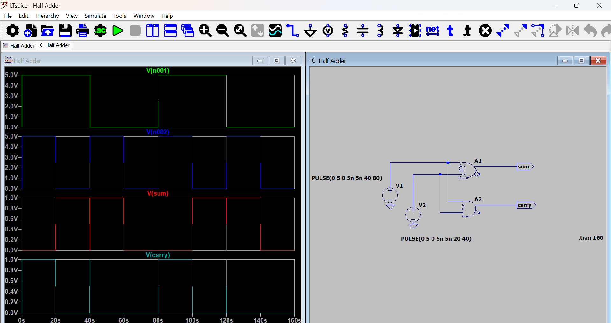

# Half-Adder Circuit

## Overview
This project implements a digital **Half-Adder** circuit. A half-adder accepts two binary inputs (A and B) and produces a Sum (A XOR B) and a Carry (A AND B) output. This is the fundamental building block for all binary arithmetic.

## Logic Truth Table
| Input A | Input B | Sum | Carry |
| :---: | :---: | :---: | :---: |
| 0 | 0 | 0 | 0 |
| 0 | 1 | 1 | 0 |
| 1 | 0 | 1 | 0 |
| 1 | 1 | 0 | 1 |

## Simulation Results
The waveform below confirms the logic by cycling through all input combinations using two pulse sources with different frequencies.

## Key Learning Points
* **Gate Combination:** Learned to combine an XOR gate (for Sum) and an AND gate (for Carry).
* **Binary Timing:** Learned to stagger `PULSE` sources in LTspice to create a repeatable truth table sequence (00, 01, 10, 11).
